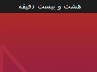

# Persian Fuzzy Clock
Replace the Gnome Shell clock with a Fuzzy clock.



# Attention
All the honor goes to @Cj-Malone. I just translated his work in Persian.

# Install


## GIT
```
git clone https://github.com/hanaforoosh/Fuzzy-Clock ${XDG_DATA_HOME:=$HOME/.local/share}/gnome-shell/extensions/fuzzy-clock@keepawayfromfire.co.uk/
```
